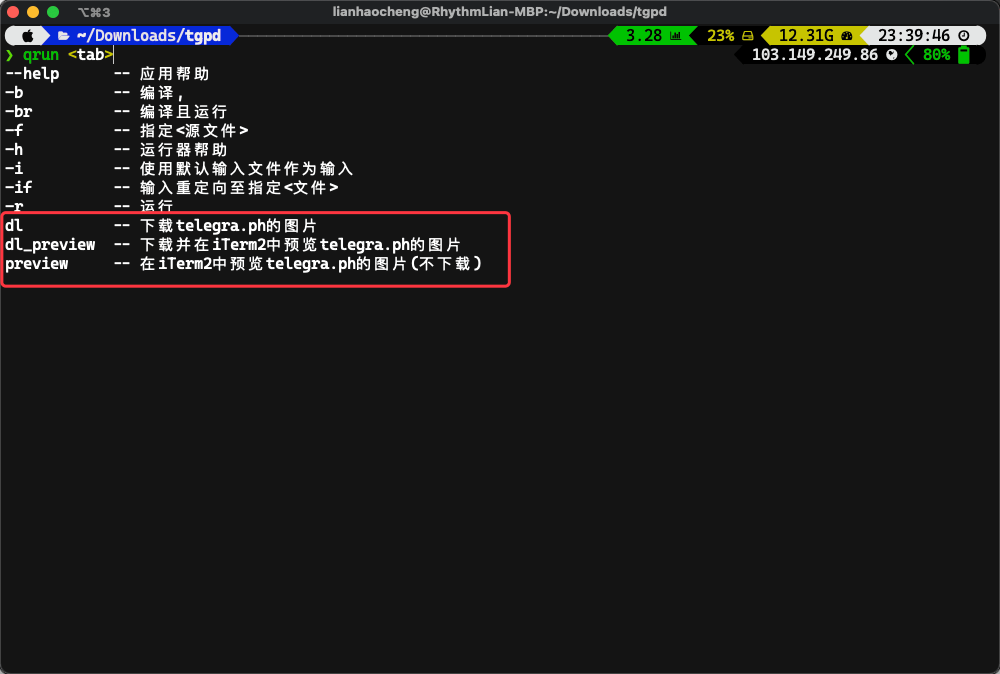
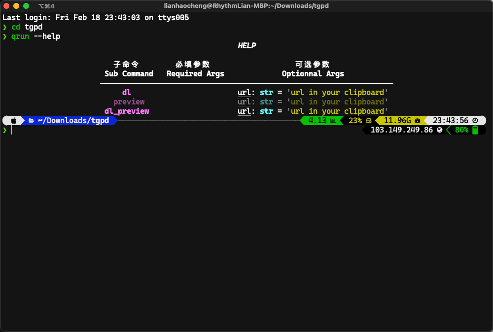
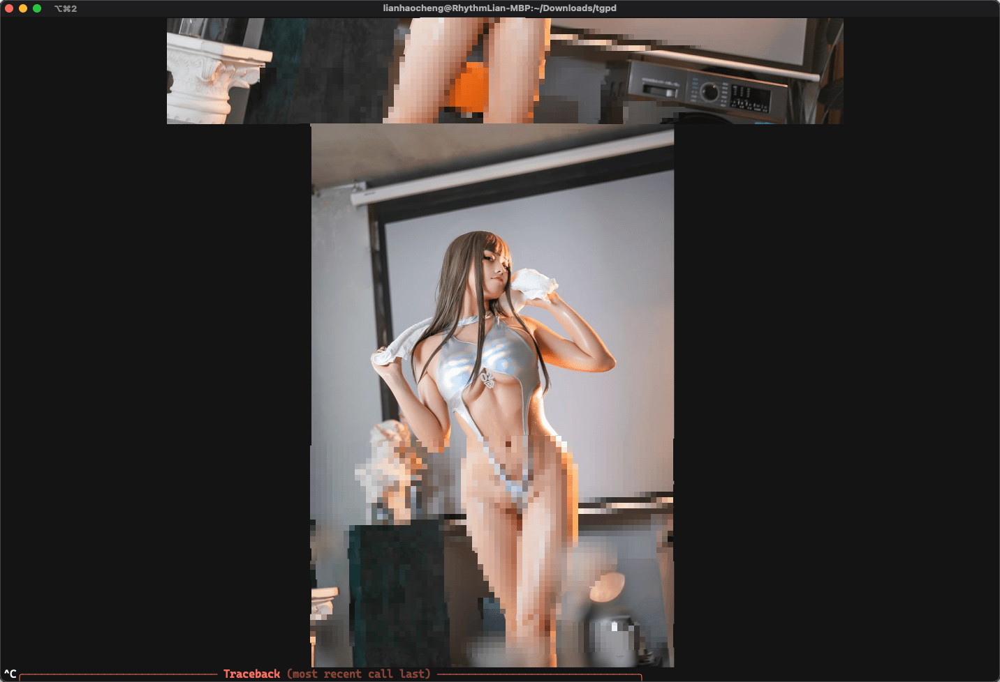

# 一个 telegra.ph 的套图下载与预览器

## 推荐环境

（请确保你具备科学上网的能力。）

- 首选：Mac + iTerm2 （可在iTerm2中直接预览图片）
- 其次：*nix系统 + Terminal
- 不推荐使用Windows终端，tabby或许可以。

## 安装

```shell
git clone https://github.com/Rhythmicc/tgpd.git
cd tgpd
pip3 install -r requirements.txt
```

## 使用

### Tab 补全

tgpd 是基于 [QuickProject (Qpro)](https://github.com/Rhythmicc/QuickProject) 开发的命令行应用，因此你可以通过配置 [QuickProject (Qpro)](https://github.com/Rhythmicc/QuickProject)的zsh tab补全来提升使用体验。



### 运行机制

在本项目文件夹下，通过`qrun --help`可以查看命令帮助:



因此，你可以直接在拷贝链接后直接运行：

```shell
qrun dl # 下载至./img
qrun preview # 仅预览
qrun dl_preview # 先下载至./img，再预览
```

如果在某些特殊情况下，你无法成功调用pyperclip库，比如你通过SSH登录了远程主机，则需要手动设置url，调用方式如下:

```shell
qrun dl --url <your url>
...
```

### 测试用链接：

1. https://telegra.ph/%E6%A1%9C%E4%BA%95%E5%AE%81%E5%AE%81---jk%E4%B9%8B%E5%B1%85%E5%AE%B6-66P-02-18
2. https://telegra.ph/Cos%E8%9C%9C%E6%B1%81%E7%8C%AB%E8%A3%98---%E7%AB%9E%E6%B3%B3-47P-10-19

## 效果展示

- `qrun preview --url https://telegra.ph/Cos%E8%9C%9C%E6%B1%81%E7%8C%AB%E8%A3%98---%E7%AB%9E%E6%B3%B3-47P-10-19`

  